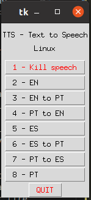

# Linux Translation and Text to Speech with natural voice
A fast method for the text that you select, Text, PDF or EPUB, re-implementation in Python from scratch.

## Description

**Note:**
This is the **version 2.0, a total re-implementation in Python with many added features, support for more languages, support for translations, optimization of shortcuts and GUI. It has a simpler installation and configuration**. Know, it only uses 2 shortcuts for everything. The first one shows the menu to select the operation, the second shortcut allow you to repeat last operation on a new selected text, without displaying the GUI. You can use the mouse to click on the buttons or use the number key to selection the operation on the GUI. <br>  
<br>




* In the following languages:
  * 1 - Kill current speech.
  * 2 - Speech in English.
  * 3 - Translate from English into Portuguese and speak.
  * 4 - Translate from Portuguese into English and speak.
  * 5 - Speech in Spanish.
  * 6 - Translate from Spanish into Portuguese and speak.
  * 7 - Translate from Portuguese into Spanish and speak.
  * 8 - Speech in Portuguese.


<br>
The objective was to achieve speed reading but in a computer screen and with full comprehension, no skimming of text.
An easy to use, fast and practical method for English, Portuguese and Spanish (you can customize to any language you need). <br>
<br>
The basic idea is that you open the PDF, you select the text for a page, hit the shortcut key combination and you will ear the natural TTS voice. The TTS doesn't tire you and you read along in the PDF following what the TTS voice reads you. You see the diagrams, you see the code, and the tables, it's simple and easy to use. And with a high level of comprehension. You can configure to be faster or slower by language, and you can configure to start immediately or to wait for a t seconds amount to let you position your eyes at the beginning of the selected text. <br>
<br>
**Important Note:** <br>
The text that you use, should be public, because this TTS uses the TTS online service from Google and it will send the selected text to Google so it can give back the audio in a mp3 file format. <br>
<br>
In this process we will use the ```/dev/shm``` RAM Disk so that you don't need to write to disk the text file and the text edits.


## The process

The process executes instantly. <br>

* We will use the **program xclip** to get the current selected text in a X program. We will not need to make copy and paste, only select the text and hit the shortcut key for the menu to TTS in English, to TTS on Portuguese, to TTS in Spanish or do any of the translations. <br>

* We will use the **program deep_translator** to translate using the google services from EN and ES to PT and from PT to EN and ES. <br>
  **deep-translator** <br>
  [https://github.com/nidhaloff/deep-translator](https://github.com/nidhaloff/deep-translator)

* We will use the **program gtts** to send the text to Google and to receive the audio in MP3. The TTS is of high natural quality. It doesn't produce fatigue. <br>
  **gtts** <br> 
  [https://github.com/pndurette/gTTS](https://github.com/pndurette/gTTS)

* Then we will pipe it to the **program play of SOX**, to play the MP3 and we will be increasing the velocity to 1.5x (easily configurable in the Python script).

* The project only uses 2 files:
  * gtts_all_in_one.py
  * gtts_all_in_one.desktop  

## To install do...

* I have Python Anaconda installed, if you have normal Python you may have to change some paths. 


``` sh
pip install gTTS
pip install -U deep_translator
sudo apt install xclip
sudo apt install sox
sudo apt-get install libsox-fmt-mp3

```

* To test if all is correctly installed, and to ear the quality of the audio, do:

``` sh
gtts-cli -l en 'Good morning!' | play -t mp3 -

```

* **Create a directory** called ```gtts_my_speak``` under your user directory. <br>

``` sh
mkdir gtts_my_speak
cd gtts_my_speak

```

* Download and put the files of the project inside the directory.

* Edit the file "gtts_all_in_one.desktop" and change the user path (joao) in gtts_all_in_one.desktop to your user.

* Copy the desktop app file file so that the shortcut in Ubuntu or Debian, can run a GUI program in the Gnome shortcuts. 

```
cp gtts_all_in_one.desktop ~/.local/share/applications

```

* Edit the python file "gtts_all_in_one.py" and if you don't have Anaconda change the ```#!/usr/bin/env /home/joao/anaconda3/bin/python``` to ```#!/usr/bin/env python```. Change also the path of Anaconda3 on line 215. <br> 

* Edit the python file "gtts_all_in_one.py" and change the MY_USER_DIR to your user directory. <br>
  Change ```/home/joao``` to your username ```/home/username``` .

* Make the Python script file executable.

```
chmod u+x ./gtts_all_in_one.py

```

* To test the GUI program do:

```  
./gtts_all_in_one.py

```

* ... and then do ... to launch the GUI from the launcher that will be used in the menu shortcut.

```
gtk-launch gtts_all_in_one.desktop

```

* Then it is necessary to create the shortcuts on Ubuntu or debian with Window Manager gnome definitions:<br>
   Change ```/home/joao``` to your username ```/home/username```. <br>
<br>
On the desktop of Ubuntu, right upper corner in the arrow pointing downwards -> Definition -> shortcuts in the keyboard -> Go to the end of the page -> click on the button  "+" -> Addd each of the shortcuts. <br>

```
Name: gtts - speak selected text - Menu
Command: gtk-launch gtts_all_in_one.desktop
keys shortcut: super + '.'  Choose one

Name: gtts - speak selected text - Repeat last option
Command: /home/joao/gtts_my_speak/gtts_all_in_one.py last_option
keys shortcut: super + '-'

```


Now, you only have to open a text in a browser, in a public PDF, public EPUB, or public text and hit the key combination to ear the Text to Speech. <br>
<br>
Remember that the selected text will go to Google to get the audio, so only use public text. <br>
<br>
The idea is not only a kind of audio book, but to ear the audio and follow along with fast reading, but at a pace that you are earing. This imposes to you the fast pace, so that you can endure for long texts like 500 pages or 1000 pages, hour after hour. <br>
<br>
While reading we will have a high degree of comprehension and we will learn much better the text, in comparison to only earing. And we can go back at any moment and read and ear a passage it again, see the diagrams, a table, or code. You can select a all page, multiple pages or a simple passage. 


## References
* The first two shell scripts where adapted from this page: <br>
  [https://askubuntu.com/questions/53896/natural-sounding-text-to-speech](https://askubuntu.com/questions/53896/natural-sounding-text-to-speech)


## I hope that this is useful to you 

* The new Spanish support and the translations where a request from my daughter. She liked to not have to go to google translator for each sentence or word that she didn't know how to translate. The speech in English and Spanish (Castellan) is also good for training her pronunciation.


## Have fun
Best regards, <br>
João Nuno Carvalho
